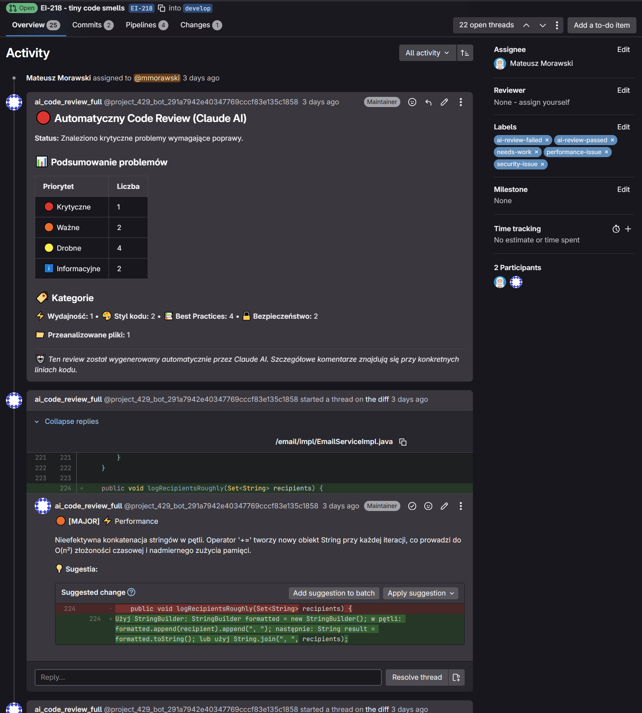
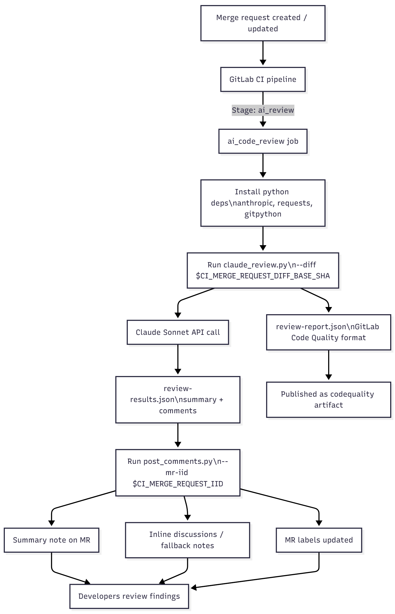

# AI Code Review Workflow

This repository contains an automated code review pipeline that uses Anthropic's Claude model to inspect merge request changes and publish review feedback directly in GitLab. The workflow is orchestrated through two Python scripts and a dedicated job in `.gitlab-ci.yml`.

## GitLab screens



## Components

- `scripts/claude_review.py`  
  Fetches the diff between the merge request base (`CI_MERGE_REQUEST_DIFF_BASE_SHA`) and `HEAD`, filters out binary or generated assets, and analyzes the remaining changes with Claude Sonnet. The script:
  - authenticates with Claude via the `ANTHROPIC_API_KEY` environment variable,
  - prepares a structured prompt per file to focus the model on the new lines in the diff,
  - parses the JSON response into `ReviewComment` entries with severity, category, and optional suggestions,
  - aggregates all findings into `review-results.json` (human-readable summary plus raw comments) and `review-report.json` (GitLab Code Quality format),
  - can fail the job when critical issues are detected and `--fail-on-needs-work` is supplied.

- `scripts/post_comments.py`  
  Reads `review-results.json` and pushes the findings to the target merge request using the GitLab REST API. It requires:
  - `CI_PROJECT_ID`, `GITLAB_TOKEN`, and optionally `CI_API_V4_URL` for authentication,
  - the merge request IID passed via `--mr-iid`.  
  The script publishes a summary note, attempts to place inline discussions on the relevant lines, falls back to regular notes when diff positions cannot be resolved, and updates merge request labels (for example `ai-review-passed`, `needs-work`, `security-issue`). Command flags allow skipping inline comments or label updates if needed.

## GitLab CI/CD Integration

The `ai_code_review` job defined in `.gitlab-ci.yml` runs in the `ai_review` stage for merge request pipelines. It uses the `python:3.11` image, installs `anthropic`, `requests`, and `gitpython`, and executes:

```bash
python3 scripts/claude_review.py --diff "$CI_MERGE_REQUEST_DIFF_BASE_SHA"
python3 scripts/post_comments.py --mr-iid "$CI_MERGE_REQUEST_IID"
```

The job uploads `review-report.json` as a Code Quality artifact so findings appear in the merge request UI. Subsequent stages (`code_analysis`, `build`, etc.) run only after this AI review stage completes, ensuring automated feedback is available early in the pipeline.

## Data Flow

1. **Diff collection** – `claude_review.py` inspects the git diff and skips non-reviewable assets.
2. **Model analysis** – Claude returns structured review comments that capture severity, category, and suggestions.
3. **Result serialization** – Comments are saved locally in JSON for downstream consumption and for GitLab Code Quality.
4. **Feedback publication** – `post_comments.py` posts the summary and inline notes, applies appropriate labels, and mirrors the review status via its exit code (`needs_work` maps to exit code `1`).

This setup enables consistent, automated code review feedback within merge requests while preserving the ability to act on the findings through GitLab's native tooling.

## Process Diagram




